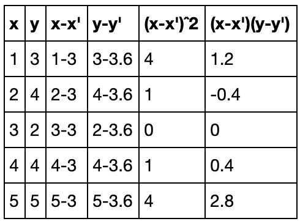

# Linear-Regression Head-Brain-Model

HeadBrain uses machine learning concepts to predict the size of Brain in against of Head weight, we train,test, analyse and predict data from our model which is built upon the concepts of Simple Linear Regression.

Prediction is done in both the ways with and without sklearn.

## How to Get Dataset

The dataset was available on [kaggle compettion - head brain](https://www.kaggle.com/jemishdonda/headbrain).

## What is Regression?

_Regression is a form of predictive modelling technique which investigates the relationship between a dependent and independent variable_

## Undestanding Linear Regression

<p align="center"></p> 
<h6 align="center">Example of how work linear regression algorithm step by step.</h6>


## Getting Started

### Prerequisites

What things you need to understand this repository

```
 Good knowledgment in Linear Regression, and basic knowledge of python.
